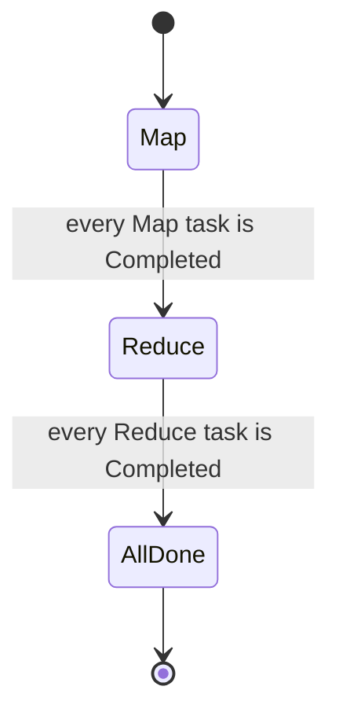
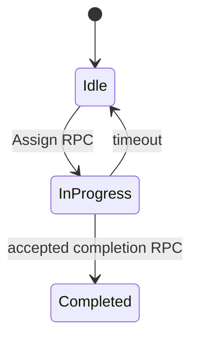

# Lab1 Map Reduce

## Result
```bash
=== RUN   TestWc
--- PASS: TestWc (8.17s)
=== RUN   TestIndexer
--- PASS: TestIndexer (5.51s)
=== RUN   TestMapParallel
--- PASS: TestMapParallel (8.03s)
=== RUN   TestReduceParallel
--- PASS: TestReduceParallel (9.02s)
=== RUN   TestJobCount
--- PASS: TestJobCount (12.02s)
=== RUN   TestEarlyExit
--- PASS: TestEarlyExit (7.02s)
=== RUN   TestCrashWorker
--- PASS: TestCrashWorker (63.13s)
PASS
ok      6.5840/mr       113.914s
````

This package implements a Coordinator that assigns Map and Reduce tasks to worker processes through RPC.

## Example Setup

Assume a job has the following input:

```text
input files: [a.txt, b.txt, c.txt, d.txt]
workers:     W1, W2, W3
nReduce:     2
```

The Coordinator creates four Map tasks and two Reduce tasks:

```text
Map tasks:    M0=a.txt, M1=b.txt, M2=c.txt, M3=d.txt
Reduce tasks: R0, R1
```

The Coordinator has three phases:



A task has its own state machine:



`Assign` and `ReportTaskCompletion` hold the Coordinator mutex while changing task state. The timeout goroutine also holds the same mutex before returning an expired task to `Idle`.

## Map Phase

Initially, every Map task is `Idle`. Workers request work through `Coordinator.Assign`.

```text
W1 receives M0 (a.txt)
W2 receives M1 (b.txt)
W3 receives M2 (c.txt)
```

Their replies have the same shape:

```go
RPCReply{
    TaskType: "map",
    TaskId:   0, // M0 for W1; 1 for W2; 2 for W3
    MapFile:  "a.txt",
    NReduce:  2,
    Attempt:  0,
}
```

When W1 finishes M0, it sends:

```go
DoneArgs{TaskType: "map", TaskId: 0, Attempt: 0}
```

The Coordinator marks M0 as `Completed` and assigns the remaining idle Map task M3 to W1. A worker that asks for work while every remaining task is `InProgress` receives `TaskType: "wait"`, sleeps briefly, and asks again.

## Intermediate Files

Each Map task partitions every `KeyValue` using:

```go
reduceID := ihash(kv.Key) % nReduce
```

With four Map tasks and `nReduce = 2`, Map output has this layout:

```text
                 Reduce partition
Map task          0             1
M0             mr-0-0        mr-0-1
M1             mr-1-0        mr-1-1
M2             mr-2-0        mr-2-1
M3             mr-3-0        mr-3-1
```

For example, every word whose hash maps to partition `1` is JSON-encoded into one of:

```text
mr-0-1, mr-1-1, mr-2-1, mr-3-1
```

## Reduce Phase

Only after M0 through M3 are `Completed` does the Coordinator change from `Map` to `Reduce`.

```text
W2 receives R0 and reads: mr-0-0 mr-1-0 mr-2-0 mr-3-0
W3 receives R1 and reads: mr-0-1 mr-1-1 mr-2-1 mr-3-1
```

Each Reduce worker decodes its JSON records, sorts them by key, groups equal keys, calls `reducef`, and writes one final output file:

```text
R0 -> mr-out-0
R1 -> mr-out-1
```

The complete job output is the union of all `mr-out-*` files.

