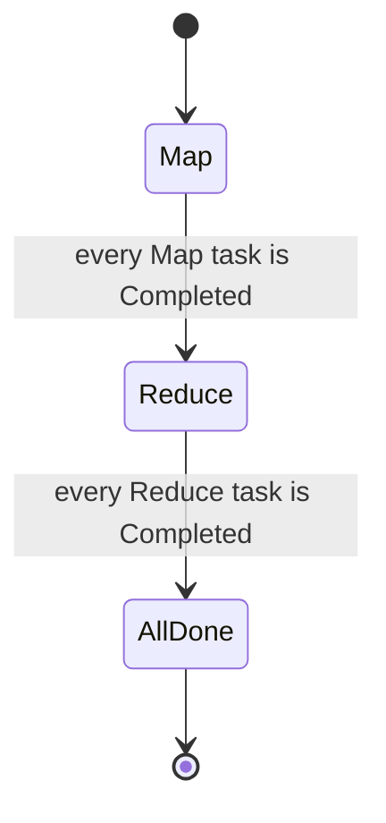
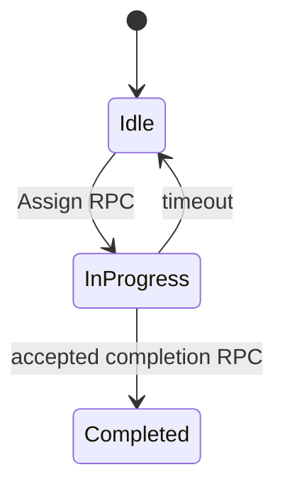
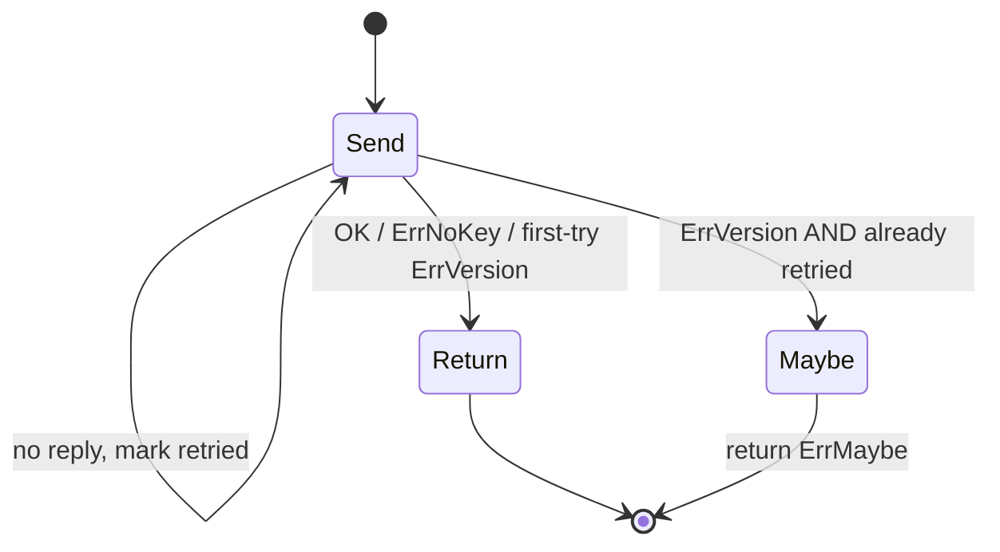
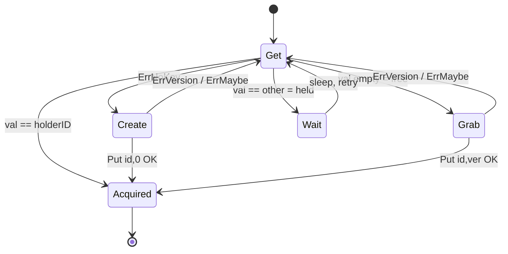
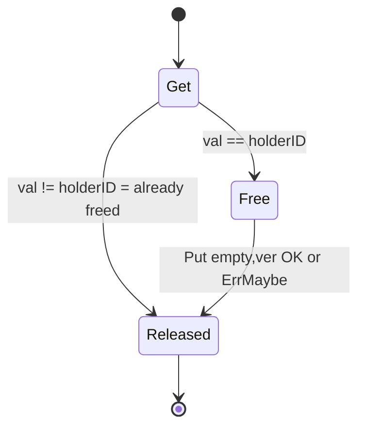

# Lab1 Map Reduce

## Result
```bash
=== RUN   TestWc
--- PASS: TestWc (8.17s)
=== RUN   TestIndexer
--- PASS: TestIndexer (5.51s)
=== RUN   TestMapParallel
--- PASS: TestMapParallel (8.03s)
=== RUN   TestReduceParallel
--- PASS: TestReduceParallel (9.02s)
=== RUN   TestJobCount
--- PASS: TestJobCount (12.02s)
=== RUN   TestEarlyExit
--- PASS: TestEarlyExit (7.02s)
=== RUN   TestCrashWorker
--- PASS: TestCrashWorker (63.13s)
PASS
ok      6.5840/mr       113.914s
````

This package implements a Coordinator that assigns Map and Reduce tasks to worker processes through RPC.

## Example Setup

Assume a job has the following input:

```text
input files: [a.txt, b.txt, c.txt, d.txt]
workers:     W1, W2, W3
nReduce:     2
```

The Coordinator creates four Map tasks and two Reduce tasks:

```text
Map tasks:    M0=a.txt, M1=b.txt, M2=c.txt, M3=d.txt
Reduce tasks: R0, R1
```

The Coordinator has three phases:


```mermaid
stateDiagram-v2
    [*] --> Map
    Map --> Reduce: every Map task is Completed
    Reduce --> AllDone: every Reduce task is Completed
    AllDone --> [*]
```

A task has its own state machine:


```mermaid
stateDiagram-v2
    [*] --> Idle
    Idle --> InProgress: Assign RPC
    InProgress --> Completed: accepted completion RPC
    InProgress --> Idle: timeout
```

`Assign` and `ReportTaskCompletion` hold the Coordinator mutex while changing task state. The timeout goroutine also holds the same mutex before returning an expired task to `Idle`.

## Map Phase

Initially, every Map task is `Idle`. Workers request work through `Coordinator.Assign`.

```text
W1 receives M0 (a.txt)
W2 receives M1 (b.txt)
W3 receives M2 (c.txt)
```

Their replies have the same shape:

```go
RPCReply{
    TaskType: "map",
    TaskId:   0, // M0 for W1; 1 for W2; 2 for W3
    MapFile:  "a.txt",
    NReduce:  2,
    Attempt:  0,
}
```

When W1 finishes M0, it sends:

```go
DoneArgs{TaskType: "map", TaskId: 0, Attempt: 0}
```

The Coordinator marks M0 as `Completed` and assigns the remaining idle Map task M3 to W1. A worker that asks for work while every remaining task is `InProgress` receives `TaskType: "wait"`, sleeps briefly, and asks again.

## Intermediate Files

Each Map task partitions every `KeyValue` using:

```go
reduceID := ihash(kv.Key) % nReduce
```

With four Map tasks and `nReduce = 2`, Map output has this layout:

```text
                 Reduce partition
Map task          0             1
M0             mr-0-0        mr-0-1
M1             mr-1-0        mr-1-1
M2             mr-2-0        mr-2-1
M3             mr-3-0        mr-3-1
```

For example, every word whose hash maps to partition `1` is JSON-encoded into one of:

```text
mr-0-1, mr-1-1, mr-2-1, mr-3-1
```

## Reduce Phase

Only after M0 through M3 are `Completed` does the Coordinator change from `Map` to `Reduce`.

```text
W2 receives R0 and reads: mr-0-0 mr-1-0 mr-2-0 mr-3-0
W3 receives R1 and reads: mr-0-1 mr-1-1 mr-2-1 mr-3-1
```

Each Reduce worker decodes its JSON records, sorts them by key, groups equal keys, calls `reducef`, and writes one final output file:

```text
R0 -> mr-out-0
R1 -> mr-out-1
```

The complete job output is the union of all `mr-out-*` files.

---

# Lab2 Key/Value Server & Lock (kvsrv1)

## Result

```text
ok  6.5840/kvsrv1        # incl. many-client race + unreliable network
ok  6.5840/kvsrv1/lock   # 1 & 10 clients, reliable + unreliable network
```

A single key/value server with **versioned Put**, a Clerk that survives dropped
messages, and a distributed lock built entirely on top of the Clerk.

## Architecture

```text
client (goroutine, id=me) ──1:1── clerk ──1:N── Lock objects
                                                  │  (each wraps one lockname)
   N clients' Lock(name) objects ────────────────┘
                       └──────► converge on ONE key "name" on the single server
```

- **1** server (this lab is single-node; replication is a later lab).
- **N** clients, each with **1** clerk (its RPC proxy); one clerk can back many locks.
- A **lock** is identified by `lockname` (a key). N clients contend on the *same key* — that
  is where mutual exclusion happens, not on the in-memory `*Lock` objects.

## Core primitive: versioned Put

The server owns a monotonic `version` per key and updates conditionally. This single
compare-and-swap is what everything else is built on.

| Return | Meaning |
| --- | --- |
| `OK` | write applied, `version++` |
| `ErrVersion` | supplied version ≠ stored version → **not** applied |
| `ErrNoKey` (Get) | key was never created |
| `ErrMaybe` (Clerk only) | a *resent* Put hit `ErrVersion` → maybe applied, maybe not |

`Put(k, v, 0)` creates a key only if it doesn't exist; any other version on a missing key is `ErrNoKey`.

## Clerk: surviving dropped messages

`Call()` returns `false` on timeout (request **or** reply lost — indistinguishable).
The Clerk retries until it gets a reply. Get is idempotent; Put needs care:


```mermaid
stateDiagram-v2
    [*] --> Send
    Send --> Send: no reply, mark retried
    Send --> Return: OK / ErrNoKey / first-try ErrVersion
    Send --> Maybe: ErrVersion AND already retried
    Return --> [*]
    Maybe --> [*]: return ErrMaybe
```

The at-most-once guarantee needs **no per-client server state** — it falls out of the
version check plus the client remembering whether it retried. The price is `ErrMaybe`.

## Lock: Acquire

Each `*Lock` holds a unique `holderID` (`RandValue`, set once in `MakeLock`). One `for`
loop; every non-OK Put just loops back to `Get`.


```mermaid
stateDiagram-v2
    [*] --> Get
    Get --> Acquired: val == holderID
    Get --> Create: ErrNoKey
    Get --> Grab: val empty = free
    Get --> Wait: val == other = held
    Create --> Acquired: Put id,0 OK
    Create --> Get: ErrVersion / ErrMaybe
    Grab --> Acquired: Put id,ver OK
    Grab --> Get: ErrVersion / ErrMaybe
    Wait --> Get: sleep, retry
    Acquired --> [*]
```

## Lock: Release

The holder is the only writer, so no loop and no genuine `ErrVersion`.


```mermaid
stateDiagram-v2
    [*] --> Get
    Get --> Free: val == holderID
    Get --> Released: val != holderID = already freed
    Free --> Released: Put empty,ver OK or ErrMaybe
    Released --> [*]
```

## Key points & easily-confused spots

| Point | Detail |
| --- | --- |
| **version vs value** | `version` (CAS) is what enforces mutual exclusion. `value` (=`holderID`) only *identifies* the holder. |
| **why unique holderID** | Needed **only** to resolve `ErrMaybe`: after an ambiguous Put, re-`Get` and check `val == holderID`. A collision would let the `val==holderID` shortcut misfire → double-hold. |
| **two axes of uniqueness** | `lockname` (key): unique *across different locks*, **shared** across contenders. `holderID` (value): unique *across contenders of the same lock*. |
| **`val == ""`** | The only writer of `""` is `Release`, so `val==""` means "created, then released → free". |
| **Release ≠ ErrVersion** | While you hold the lock nobody else writes the key, so its version can't change between Release's Get and Put. Only `OK`/`ErrMaybe` occur — both mean released. |
| **`kv.mu` vs the Lock** | `kv.mu` is an in-process mutex guarding the map for microseconds. The distributed Lock is cross-process, built on versioned Put, held for the whole critical section. `kv.mu` makes each Put atomic; the Lock composes those atomic Puts into higher-level exclusion. |
| **lock key ≠ protected data** | The `lockname` key stores only lock state (holder / free). Application data lives under *other* keys (e.g. `"l0"` in the test); the lock just gates who may touch them. |

